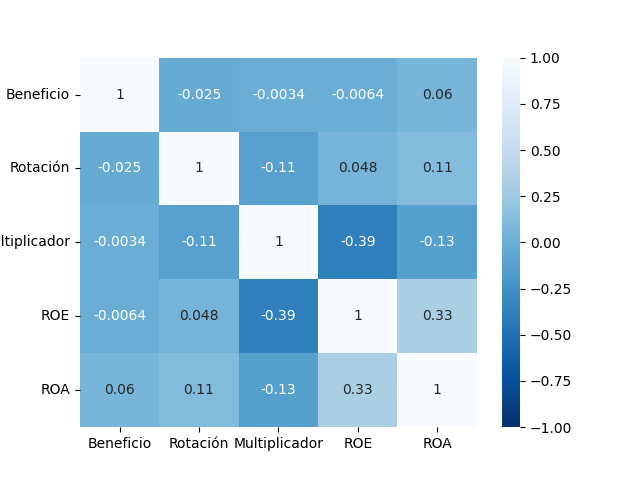

[Índice](../README.md#índice)

# Anexos

## Tablas

### Tabla 1
*Miembros del MILA y su total de empresas que cotizan*

| País     |   Empresas |   Porcentaje |
|:---------|-----------:|-------------:|
| Mexico   |        141 |        40.63 |
| Chile    |        107 |        30.84 |
| Peru     |         52 |        14.99 |
| Colombia |         47 |        13.54 |
|          |        347 |       100    |

> Nota: Adaptado de los datos de [TradingView (2020)](../referencias#tview2020).

### Tabla 2
*Ratios porcentuales promedios del MILA por país*

| País     |   Beneficio |   Rotación |   Multiplicador |   ROE |   ROA |
|:---------|------------:|-----------:|----------------:|------:|------:|
| Peru     |     -136.02 |      49.54 |          316.53 | 10.00 |  4.40 |
| Chile    |     3084.90 |      48.25 |          301.24 |  9.69 |  3.72 |
| Colombia |       28.62 |      43.94 |          401.34 |  7.94 |  2.77 |
| Mexico   |     -540.75 |      53.54 |          425.89 |  4.15 |  3.77 |

> Nota: Adaptado de los datos de [TradingView (2020)](../referencias#tview2020).

## Figuras

### Figura 1

$$ROE = \frac{Ingresos\ netos} {Recursos\ de\ los\ accionistas} , ROA = \frac{Ingresos\ netos} {Activos\ totales}$$

$$ROE = {Margen\ de\ beneficio\ neto} \times {Rotación\ de\ activos} \times {Multiplicador\ patrimonial}$$

$$ROE = \frac{Ingresos\ netos} {Ventas} \times \frac{Ventas} {Activos\ totales} \times \frac{Activos\ totales} {Recursos\ de\ los\ accionistas}$$

*Fórmula del modelo DuPont*
> Nota: Adaptado de [Bunea etal. (2019)](../referencias#bunea2019).

### Figura 2

*Correlación de Pearson del MILA*
> Nota: Adaptado de los datos de [TradingView (2020)](../referencias#tview2020).

### Figura 3

$$ROE = 0{.}1785039 -0{.}0000117(X_1) +0{.}0036649(X_2) -0{.}0293105(X_3)$$

*Ecuación de regresión lineal múltiple del MILA*
Donde:
* $I$: Intercepto o constante
* $X_1$: Margen de beneficio neto
* $X_2$: Rotación de activos
* $X_3$: Multiplicador patrimonial
* Con $R^2$ Ajustado: 0.1494466